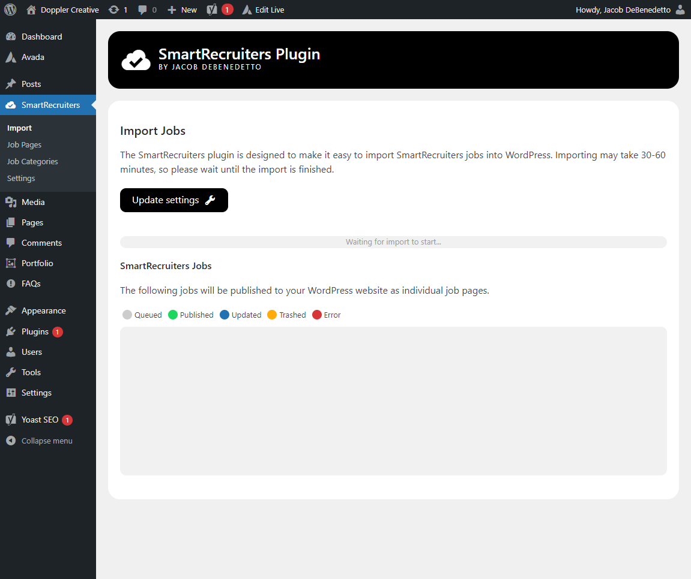
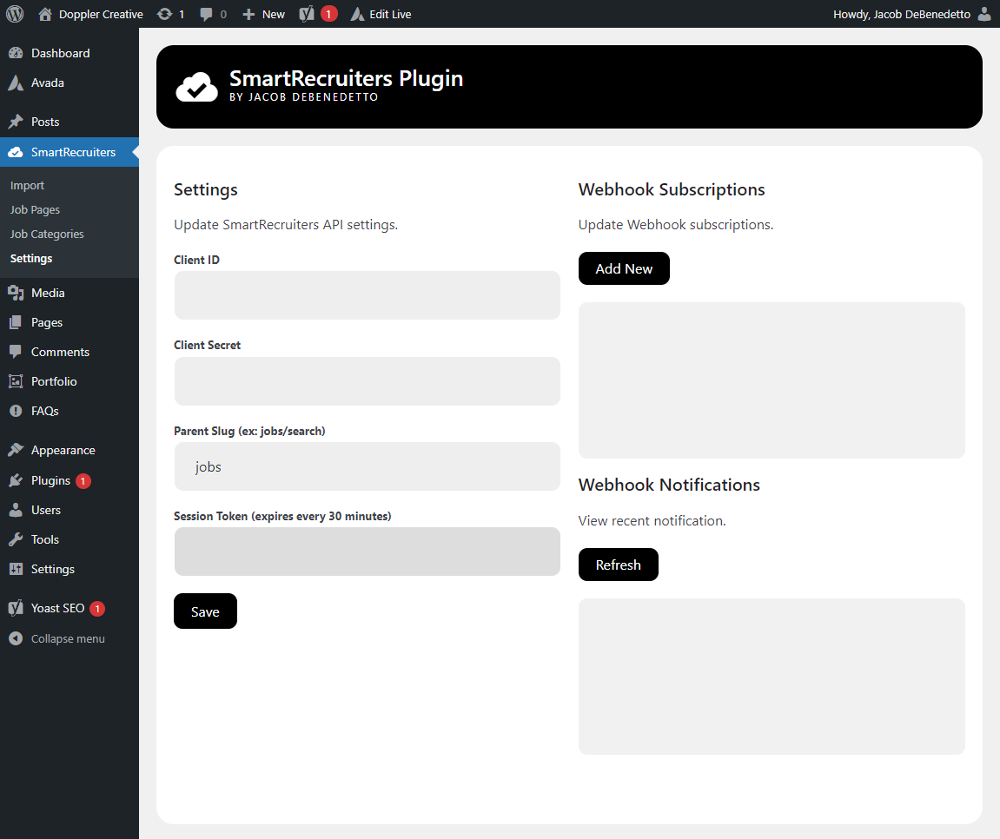
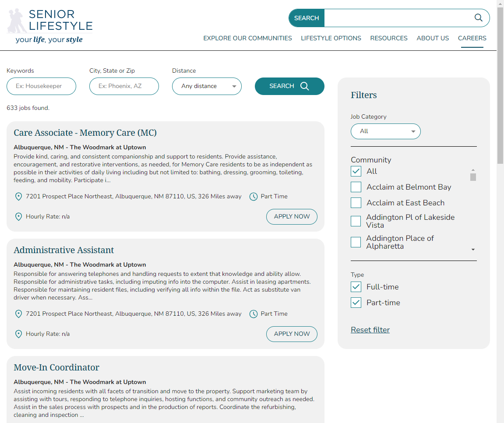

# SmartRecruiters WordPress Plugin

The SmartRecruiters plugin includes the following features:

- Automatically import jobs from SmartRecruiters into WordPress pages using the SmartRecruiters Webhook API
- Manually import jobs from SmartRecruiters' into WordPress job pages using the SmartRecruiters Job API
- Search & Filter job pages using a shortcode widget that can be embedded anywhere.

## Requirements

You will need to create new credentials from the SmartRecruiter's Custom Application page:
https://www.smartrecruiters.com/settings/administration/app-management/custom-applications

Your custom app must include the following scope:

- jobs_publications_manage
- jobs_read
- webhooks_delete
- webhooks_manage
- webhooks_read
- webhooks_write

Please copy the **Client ID** and **Client Secret** into a safe place after creating the new credentials. You will need to paste these into the Smartrecruiters WordPress settings page (www.example.com/wp-admin/admin.php?page=smartrecruiters-settings)

## Screenshots

Import Page:

Settings Page:

Job Search Page:

Job Page:
